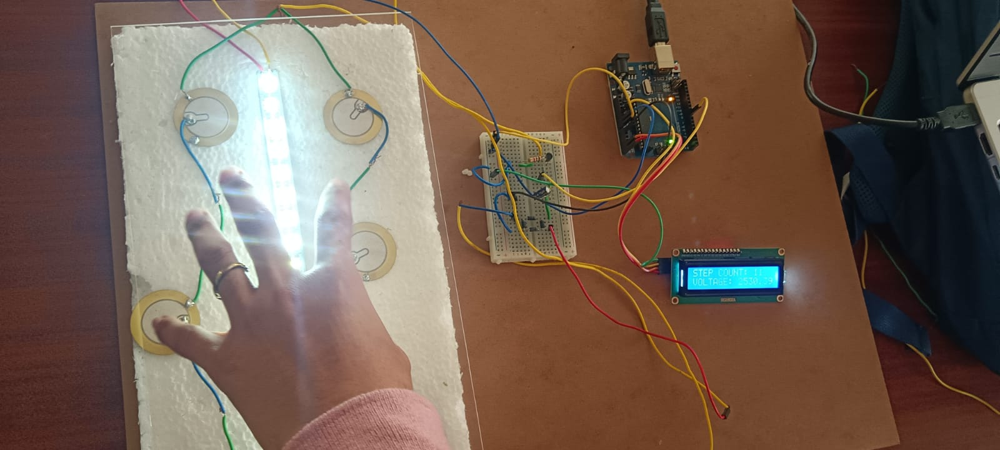

# ⚡ Footstep Power Generation System using Arduino

## 📌 Overview
This project generates electrical energy from human footsteps using piezoelectric sensors. The mechanical pressure applied on the surface is converted into electrical energy, which can be stored and used for small-scale applications.

## 🎯 Objective
To develop a renewable and eco-friendly energy generation system using human movement.

## ⚙️ Components Used
- Piezoelectric sensors  
- Arduino Uno  
- Bridge Rectifier  
- Capacitor  
- Rechargeable Battery  
- LED  
- Connecting wires  

## 🔄 Working Principle
When a person steps on the platform, pressure is applied on piezoelectric sensors. These sensors convert mechanical energy into electrical energy. The generated voltage is rectified and stored in a battery, which can be used to power small devices.

## 🚀 Applications
- Railway stations  
- Shopping malls  
- Smart cities  
- Street lighting systems  

## 📷 Project Image

## 💡 Future Enhancements
- Increase efficiency using better sensors  
- Integrate IoT for monitoring energy generation  
- Use in large-scale public areas  

## 👩‍💻 Author
Shwetha N
